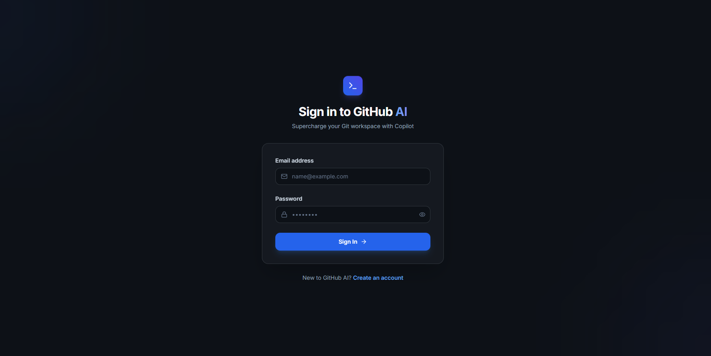
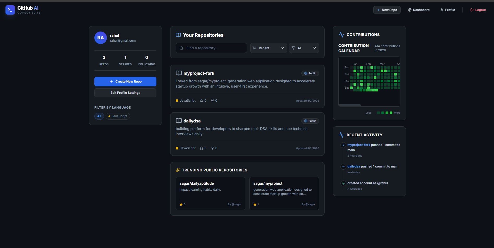
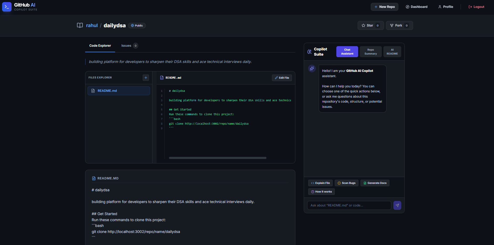
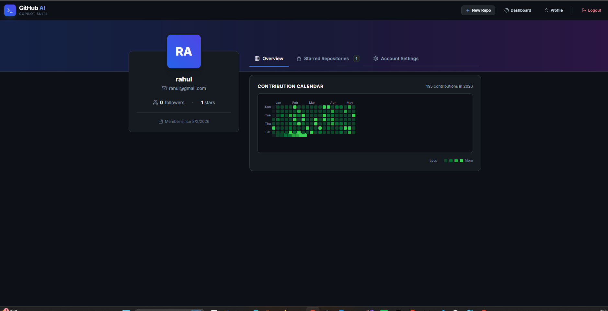

# 🚀 GitHub AI Assistant

An AI-powered GitHub-inspired repository management platform built using the **MERN Stack** and **Google Gemini AI**. The application enables users to securely create and manage repositories, track issues, and leverage AI to generate repository descriptions, summaries, and README content.

---

## 🌐 Live Demo

### Frontend (Vercel)

🔗 https://github-ai-assistant-steel.vercel.app

### Backend (Render)

🔗 https://github-ai-assistant-lawa.onrender.com

---

# 📸 Project Screenshots

## 🔐 Login Page



---

## 📊 Dashboard



---

## 📁 Repository



---

## 👤 User Profile



---

# ✨ Features

## 🔐 Authentication

- User Signup
- Secure Login
- JWT Authentication
- Protected Routes
- Persistent User Sessions

---

## 📂 Repository Management

- Create Repository
- View Repository
- Update Repository
- Delete Repository
- Public & Private Repository Support

---

## 🤖 AI Features

Powered by **Google Gemini AI**

- AI README Generator
- AI Repository Description Generator
- AI Repository Summary
- AI Coding Assistant

---

## 📝 Issue Management

- Create Issues
- View Issues
- Update Issues
- Delete Issues

---

## 👤 User Dashboard

- User Profile
- Repository Ownership
- Repository Statistics

---

# 🛠 Tech Stack

### Frontend

- React.js
- React Router DOM
- Axios
- Tailwind CSS
- React Hot Toast
- Lucide React

### Backend

- Node.js
- Express.js
- JWT Authentication
- Mongoose
- MongoDB Driver

### Database

- MongoDB Atlas

### AI Integration

- Google Gemini API

### Deployment

- Vercel
- Render

---

# 📂 Project Structure

```text
github-ai-assistant
│
├── backend-main
│   ├── config
│   ├── controllers
│   ├── middleware
│   ├── models
│   ├── routes
│   ├── index.js
│   └── package.json
│
├── frontend-main
│   ├── public
│   ├── src
│   │   ├── components
│   │   ├── pages
│   │   ├── hooks
│   │   └── main.jsx
│   └── package.json
│
├── screenshots
│   ├── login.png
│   ├── dashboard.png
│   ├── repository.png
│   └── profile.png
│
└── README.md
```

---

# ⚙️ Installation

## Clone Repository

```bash
git clone https://github.com/OmPrasad1433/github-ai-assistant.git
```

---

## Backend Setup

```bash
cd backend-main

npm install

npm start
```

---

## Frontend Setup

```bash
cd frontend-main

npm install

npm run dev
```

---

# 🔑 Environment Variables

## Backend (.env)

```env
PORT=3002

MONGODB_URI=YOUR_MONGODB_CONNECTION_STRING

JWT_SECRET_KEY=YOUR_SECRET_KEY

CLIENT_URL=http://localhost:5173

AI_PROVIDER=gemini

GEMINI_MODEL=gemini-3.5-flash

GEMINI_API_KEY=YOUR_GEMINI_API_KEY
```

---

## Frontend (.env)

```env
VITE_API_URL=http://localhost:3002
```

---

# 🚀 Future Enhancements

- GitHub OAuth Authentication
- Repository Search
- Repository Collaborators
- Pull Requests
- Notifications
- Markdown Editor
- File Upload Support
- Dark / Light Theme

---

# 🐛 Production Debugging

During production deployment, an issue occurred because **MongoClient** and **Mongoose** were connected to different MongoDB databases. This caused repository creation to fail with an **Owner not found** error.

The issue was resolved by configuring both MongoDB clients to use the same database specified in the MongoDB connection string, ensuring consistent data access across the application.

---

# 📚 What I Learned

This project helped me gain hands-on experience in:

- Full Stack MERN Development
- REST API Development
- JWT Authentication
- MongoDB Atlas
- Mongoose ODM
- Google Gemini AI Integration
- Environment Variable Management
- Production Deployment
- CORS Configuration
- Git & GitHub Workflow
- Debugging Real-World Production Issues

---

# 👨‍💻 Author

**Om Prasad Sahoo**

B.Tech – Information Technology

Odisha University of Technology and Research (OUTR)

GitHub: https://github.com/OmPrasad1433

---

# ⭐ Support

If you found this project useful, please consider giving it a ⭐ on GitHub.
