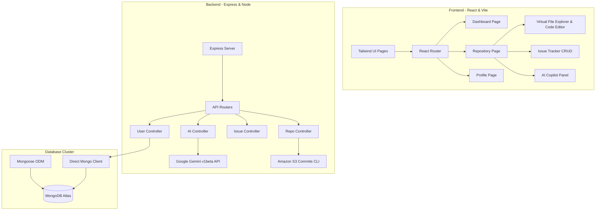

# GitHub AI — Premium Copilot MERN Platform

A state-of-the-art MERN-stack GitHub clone transformed into a production-grade startup product featuring an interactive virtual filesystem, built-in code editor, issue tracker, contribution timeline, and an integrated Google Gemini AI Copilot suite.

---

## Architecture Diagram



---

## Core System Overview

*   **Tailwind Migration**: Fully migrated from old custom stylesheets to pure Tailwind CSS using a sticky glassmorphic theme.
*   **Virtual Filesystem**: The backend stores repository files as string objects. We wrap this into a JSON-serialized virtual directory structure. This enables creating files, modifying contents, and tracking commit history dynamically without database schema migrations.
*   **Gemini AI Copilot Suite**:
    1.  **AI README Generator**: Scans languages and files to draft a professional README.md.
    2.  **AI Commit Message Suggester**: Scans active editor file changes to suggestconventional Git commits.
    3.  **AI Description Helper**: Formulates project marketing summaries in real-time.
    4.  **Floating Copilot Chat**: Conversational developer assistant aware of repository file structures, current file edits, and user requests (explain code, scan bugs, generate documentation).

---

## Environment Variables

### Backend (`backend-main/.env`)
```env
PORT=3002
MONGODB_URI=mongodb+srv://<username>:<password>@cluster.mongodb.net/githubclone
JWT_SECRET_KEY=your_jwt_secret_key_here

# AWS Configuration (Used by apnaGit CLI)
AWS_ACCESS_KEY_ID=your_aws_key
AWS_SECRET_ACCESS_KEY=your_aws_secret
AWS_REGION=ap-south-1
S3_BUCKET=your_s3_bucket_name

# AI Integration Configuration
AI_PROVIDER=gemini
GEMINI_API_KEY=your_google_gemini_api_key_here
OPENAI_API_KEY=your_openai_api_key_here
```

### Frontend (`frontend-main/.env`)
```env
VITE_API_URL=http://localhost:3002
```

---

## API Documentation

### Authentication
*   `POST /signup` - Registers a new user. Returns JWT token and User ID.
*   `POST /login` - Log in with email & password. Returns JWT token and User ID.
*   `GET /userProfile/:id` - Fetches user profile card details, starred repos, and followers.
*   `PUT /updateProfile/:id` - Updates user profile email or password (MERN CRUD).
*   `DELETE /deleteProfile/:id` - Deletes user profile and associated data (MERN CRUD).

### Repository Operations
*   `POST /repo/create` - Creates a new public/private repository.
*   `GET /repo/all` - Lists all repositories in the system (includes star and fork counts).
*   `GET /repo/:id` - Fetches repository files, issues, and metadata by database ID.
*   `GET /repo/name/:name` - Fetches repository by string identifier.
*   `PUT /repo/update/:id` - Commits a virtual file edit or addition.
*   `DELETE /repo/delete/:id` - Deletes a repository.
*   `PATCH /repo/star/:id` - Stars or unstars a repository.
*   `POST /repo/fork/:id` - Forks a repository under the logged-in user's ownership.

### Issue Tracker
*   `GET /issue/all/:id` - Lists all issues for a repository.
*   `POST /issue/create/:id` - Creates a new issue (defaults to open status).
*   `PUT /issue/update/:id` - Closes, reopens, or updates an issue title/description.
*   `DELETE /issue/delete/:id` - Deletes an issue.

### AI Endpoints
*   `POST /ai/chat` - Generates a conversational response from Copilot based on repo structure, file content, and chat history.
*   `POST /ai/generate-readme` - Drafts formatting for `README.md`.
*   `POST /ai/commit-message` - Generates conventional commit messages.
*   `POST /ai/generate-description` - Creates marketing project descriptions.
*   `POST /ai/summarize-repo` - Analyzes repository trees and summarizes architecture.

---

## Deployment Guide

### Database (MongoDB Atlas)
1. Create a free M0 tier cluster in MongoDB Atlas.
2. In Network Access, allow access from `0.0.0.0/30` (anywhere).
3. In Database Access, create a readWrite user.
4. Copy the connection string (MERN Atlas URI format) for your backend `.env`.

### Backend (Render Deployment)
1. Create a Web Service on Render.
2. Link your GitHub repository.
3. Choose **Node** runtime.
4. Set Build Command: `npm install`
5. Set Start Command: `node index.js start`
6. Add all keys from `backend-main/.env` to the Environment variables dashboard (especially `MONGODB_URI`, `JWT_SECRET_KEY`, and `GEMINI_API_KEY`).

### Frontend (Vercel Deployment)
1. Import the project root/frontend directory to Vercel.
2. Choose **Vite** framework preset.
3. Set Root Directory to `frontend-main`.
4. Under Environment Variables, add `VITE_API_URL` pointing to your deployed Render URL.
5. Deploy!
